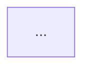

# Flow

Map the app's navigation surface so both agents and developers can see the shape of the codebase at a glance. `flow` is an **information surface**, not an analyzer — it surfaces facts (screens, navigators, transitions, deep links) and renders them as a Mermaid graph plus a screen inventory. It does not score, audit, or recommend.

Use it when:
- A developer is new to the codebase and wants the architecture in one view.
- An agent is about to work on a screen and needs to know what reaches it and what it reaches.
- The team wants a navigation diagram to drop into docs or a design discussion.

Do not use it when the user wants UX critique on a flow (use `critique`), redesign of a flow (use `rethink` or `shape`), or accessibility/perf checks (use `audit`). Flow draws the map; other commands evaluate the territory.

## Step 1: Run the Reconnaissance Script

```bash
node .claude/skills/impeccable-native/scripts/flow-scan.mjs --dir=.
```

The script calls `detect-rn-flavor.mjs` internally and branches:

- `router: "expo-router"` → walks the `app/` directory. Each file is a route; `_layout.tsx` defines navigator nesting; `(group)` folders are route groups (invisible in URL); `[param]` files are dynamic routes; `[...rest]` are catch-all.
- `router: "react-navigation"` → parses `createXNavigator` calls, `<Stack.Screen name=...>` JSX, `navigation.navigate('Foo')` call sites, and `linking.config.screens`.
- `router: "unknown"` → no supported router detected. Report that to the developer and stop — there is no navigation surface to map.

The output is a single JSON document:

```
{
  router, flavor,
  screens:     [ { name, file, route, params, kind, navigator? } ],
  navigators:  [ { name, type, file, line, children } ],
  transitions: [ { from, to, targetRoute?, file, line, kind } ],
  deepLinks:   [ { path, screen, file, line } ],
  entryPoints: [ { file, line, kind } ],
  summary:     { totalScreens, totalNavigators, totalTransitions, totalDeepLinks, note }
}
```

Consume the full JSON. Do not pipe through `head`, `tail`, `grep`, or `jq`.

## Step 2: Render the Mermaid Graph

Emit a single `flowchart TD` Mermaid block. The graph is **flat** — no node sizing or coloring by importance. Visual structure encodes *what kind of thing* each node is, not how central it is.

### Header — classDefs and legend hooks

Start every graph with the same theming block so the visual language is consistent across projects:

```
flowchart TD
  classDef start fill:#ADC6FF,stroke:#1d3a82,stroke-width:2px,color:#0b1226,font-weight:bold
  classDef tabsNav fill:#FFF4D6,stroke:#a07b00,color:#3a2d00
  classDef stackNav fill:#F2F2F4,stroke:#7d7d85,color:#1a1a1f
  classDef drawerNav fill:#E6E0FF,stroke:#5a3fb8,color:#1c133f
  classDef slotNav fill:#E0F4EC,stroke:#1f7a55,color:#0b2e22
  classDef modalLayer fill:#FFE4E1,stroke:#a23b30,color:#3a0f0a,stroke-dasharray: 4 2
```

### Rules

1. **Group non-modal screens by their host navigator.** Each navigator becomes a `subgraph` with header `<glyph> <Type>: <name>` and the matching `classDef` applied via `class navName navType` outside the subgraph block:
   - `tabs` → `▭▭▭ Tabs: <name>` + `tabsNav`
   - `stack` → `▤ Stack: <name>` + `stackNav`
   - `drawer` → `☰ Drawer: <name>` + `drawerNav`
   - `slot` → `◇ Slot: <name>` + `slotNav`
   - `unknown` → `? Navigator: <name>` + `stackNav` (fallback)

   Nested navigators (e.g. a tabs layout inside a root stack) become nested subgraphs.

2. **Modals live on their own plane.** Pull every screen with `kind: "modal"` *out* of its declared host navigator subgraph and into a single bottom subgraph: `subgraph modals["⊕ Modal layer"]` with class `modalLayer`. Modals never render inside a stack/tabs subgraph, even if that's where the scan says they live — they overlay everything.

3. **Node id** is the screen `name`; **label** is `name<br/>route` if `route` differs from `name`. For dynamic routes, interpolate params cleanly: a screen at `/profile/[id]` renders as label `profile<br/>/profile/:id`, not `[id]<br/>/profile/[id]`.

4. **Entry point styling, no floating entry node.** Do **not** emit a separate `entry(( ... ))` node pointing into the graph. Instead, find the screen whose route is `/` (or, if absent, the first screen of the root navigator) and apply the `start` class to it: `class home start`. Append ` ⭐` to its label so it reads as the entry at a glance. The entry point is a property of a real screen, not a floating annotation.

5. **Edges** come from `transitions`. Resolve `to` to a known screen id when `targetRoute` matches a screen's route; otherwise keep the raw target as the label and draw a dashed edge (`-.->`) to indicate the destination is external or unresolved.

6. **Edge style encodes plane crossing.**
   - Solid arrow (`-->`) for transitions *within* the same navigator subgraph (regular push/navigate within a stack, tab switch within a tabs container).
   - Dashed arrow (`-.->`) for transitions that *cross planes*: any edge whose target is in the modal layer, any edge whose target is in a different top-level navigator, and any unresolved/external target.

7. **Edge labels** are the transition `kind` (`push`, `replace`, `navigate`, `link`). If multiple transitions exist between the same two nodes with the same kind, collapse to one edge. If kinds differ, show one edge per distinct kind.

### Size handling

Keep the graph readable. If there are more than ~25 screens, emit one Mermaid graph per top-level navigator instead of one giant graph, and add a small "navigator index" graph above showing only the navigators and their nesting. The modal layer always stays as its own subgraph at the bottom of the main graph (or in the index graph if you split).

### Legend

Immediately below the Mermaid block, emit a short markdown legend so a reader can decode the glyphs and edge styles without guessing:

```markdown
**Legend**
- `▭▭▭ Tabs` · `▤ Stack` · `☰ Drawer` · `◇ Slot` — navigator types
- `⊕ Modal layer` — overlays on top of any screen
- `⭐` — entry point (the screen the app opens on)
- Solid arrow — transition within the same navigator
- Dashed arrow — crosses into the modal layer, a different navigator, or an unresolved target
```

## Step 3: Emit the Screen Inventory

Below the Mermaid graph(s), produce a markdown table with one row per screen:

| Screen | Route | Params | Navigator | File |
|---|---|---|---|---|
| `HomeScreen` | `/home` | — | `RootStack` | `app/(tabs)/home.tsx` |
| `ProfileScreen` | `/profile/[id]` | `id` | `RootStack` | `app/profile/[id].tsx` |

Sort by navigator, then by route. Use backticks for code, em-rule (`—`) for empty cells. Do not collapse this table — agents read it as the lookup index.

## Step 4: Emit the Deep-Link Index

If `deepLinks` is non-empty, add a second markdown table:

| Path | Screen | Source |
|---|---|---|
| `myapp://profile/:id` | `ProfileScreen` | `App.tsx:42` |

For expo-router, the route IS the deep link — this table mirrors the screen routes. For react-navigation, it comes from the `linking.config.screens` block parsed by the scan.

## Step 5: Closing Note

End the report with the `summary.note` from the scan, verbatim. No editorializing, no recommendations, no "next steps."

## Output Shape

The full deliverable is a single markdown document:

```
# Flow: <project name>



## Screens
<inventory table>

## Deep Links
<deep-link table — omit section if empty>

<summary note>
```

That is the entire artifact. The developer or a downstream agent reads it once and has the architecture in their head.

**NEVER**:
- Add recommendations, scores, or "issues found" sections. Flow is descriptive, not evaluative.
- Invent screens, routes, or transitions not present in the scan output.
- Skip the Mermaid graph when screens exist — the visual is the point.
- Re-render the JSON. The JSON is intermediate; the markdown report is the product.
- Run other commands (`audit`, `critique`) inside flow. If the developer wants those, they will invoke them separately.
