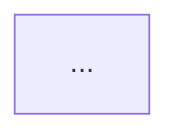

# Flow

Map the app's navigation surface so both agents and developers can see the shape of the codebase at a glance. `flow` is an **information surface**, not an analyzer — it surfaces facts (screens, navigators, transitions, deep links) and renders them as a Mermaid graph plus a screen inventory. It does not score, audit, or recommend.

Use it when:
- A developer is new to the codebase and wants the architecture in one view.
- An agent is about to work on a screen and needs to know what reaches it and what it reaches.
- The team wants a navigation diagram to drop into docs or a design discussion.

Do not use it when the user wants UX critique on a flow (use `critique`), redesign of a flow (use `rethink` or `shape`), or accessibility/perf checks (use `audit`). Flow draws the map; other commands evaluate the territory.

## Step 1: Run the Reconnaissance Script

```bash
node {{scripts_path}}/flow-scan.mjs --dir=.
```

The script calls `detect-rn-flavor.mjs` internally and branches:

- `router: "expo-router"` → walks the `app/` directory. Each file is a route; `_layout.tsx` defines navigator nesting; `(group)` folders are route groups (invisible in URL); `[param]` files are dynamic routes; `[...rest]` are catch-all.
- `router: "react-navigation"` → parses `createXNavigator` calls, `<Stack.Screen name=...>` JSX, `navigation.navigate('Foo')` call sites, and `linking.config.screens`.
- `router: "unknown"` → no supported router detected. Report that to the developer and stop — there is no navigation surface to map.

The output is a single JSON document:

```
{
  router, flavor,
  screens:     [ { name, file, route, params, kind, navigator? } ],
  navigators:  [ { name, type, file, line, children } ],
  transitions: [ { from, to, targetRoute?, file, line, kind } ],
  deepLinks:   [ { path, screen, file, line } ],
  entryPoints: [ { file, line, kind } ],
  summary:     { totalScreens, totalNavigators, totalTransitions, totalDeepLinks, note }
}
```

Consume the full JSON. Do not pipe through `head`, `tail`, `grep`, or `jq`.

## Step 2: Render the Mermaid Graph

Emit a single `flowchart TD` Mermaid block. Rules, in order:

1. **Group nodes by navigator.** Each navigator becomes a `subgraph` with the navigator's name and type (`stack`, `tabs`, `drawer`, `slot`). For expo-router, the root `_layout` is the outermost subgraph and nested folders with `_layout.tsx` are nested subgraphs.
2. **Node id** is the screen `name`; **label** is `name<br/>route` if `route` differs from `name`. Append `[param]` markers for dynamic routes.
3. **Edges** come from `transitions`. Resolve `to` to a known screen id when `targetRoute` matches a screen's route; otherwise keep the raw target as the label and draw a dashed edge (`-.->`) to indicate the destination is external or unresolved.
4. **Edge labels** are the transition `kind` (`push`, `replace`, `navigate`, `link`). Omit the label if every edge between two nodes uses the same kind.
5. **Entry points** get a `(( ))` shape and a `start` style class. Modals get a `{{ }}` shape.

Keep the graph readable. If there are more than ~25 screens, emit one Mermaid graph per top-level navigator instead of one giant graph, and add a small "navigator index" graph above showing only the navigators and their nesting.

## Step 3: Emit the Screen Inventory

Below the Mermaid graph(s), produce a markdown table with one row per screen:

| Screen | Route | Params | Navigator | File |
|---|---|---|---|---|
| `HomeScreen` | `/home` | — | `RootStack` | `app/(tabs)/home.tsx` |
| `ProfileScreen` | `/profile/[id]` | `id` | `RootStack` | `app/profile/[id].tsx` |

Sort by navigator, then by route. Use backticks for code, em-rule (`—`) for empty cells. Do not collapse this table — agents read it as the lookup index.

## Step 4: Emit the Deep-Link Index

If `deepLinks` is non-empty, add a second markdown table:

| Path | Screen | Source |
|---|---|---|
| `myapp://profile/:id` | `ProfileScreen` | `App.tsx:42` |

For expo-router, the route IS the deep link — this table mirrors the screen routes. For react-navigation, it comes from the `linking.config.screens` block parsed by the scan.

## Step 5: Closing Note

End the report with the `summary.note` from the scan, verbatim. No editorializing, no recommendations, no "next steps."

## Output Shape

The full deliverable is a single markdown document:

```
# Flow: <project name>



## Screens
<inventory table>

## Deep Links
<deep-link table — omit section if empty>

<summary note>
```

That is the entire artifact. The developer or a downstream agent reads it once and has the architecture in their head.

**NEVER**:
- Add recommendations, scores, or "issues found" sections. Flow is descriptive, not evaluative.
- Invent screens, routes, or transitions not present in the scan output.
- Skip the Mermaid graph when screens exist — the visual is the point.
- Re-render the JSON. The JSON is intermediate; the markdown report is the product.
- Run other commands (`audit`, `critique`) inside flow. If the developer wants those, they will invoke them separately.
